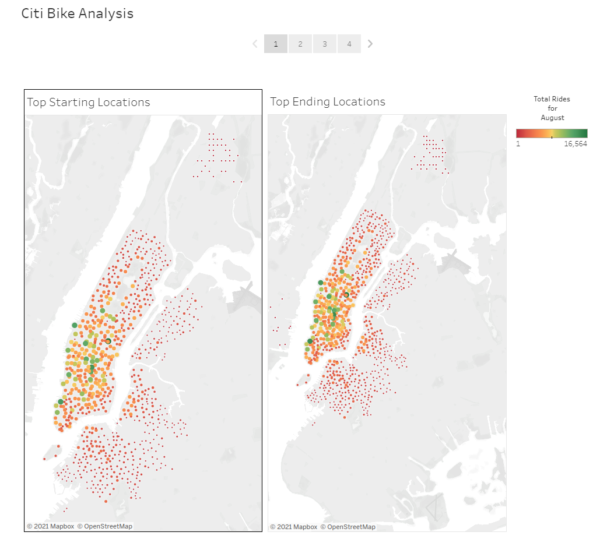

# bikesharing
# Citi Bike August Analysis

## Overview of the analysis
The purpose  of this analysis is to convince investors that a bike-sharing program in Des Moines is a solid 
business proposal. To solidify the proposal, a bike trip analysis of August was created. Refer to the Tableau
link below to access the Tableau Dashboard.

-[Citi Bike August Analysis](https://public.tableau.com/app/profile/christian.cardenas2524/viz/NYCCitiBikeAugustAnalysis/CitiBikeAnalysis "link to dashboard")

## Results
- After editing the orginal csv data for the month of August for Citi Bike Trips, I created a Tableau Dashboard
to visualize some key points of the data. Below are all the different visualizations in the workbook and a description:
	* Top Starting Locations - This shows the locations where most people checkedout a citi bike for a ride.
	* Top Ending Locations - This shows the locations where most people returns a citi bike at the end of a ride.
		- Both Starting and Ending locations are visualized by color and size the bigger the circle the more people.
		- The color can be gauged by the legend on the side the darker the red the less amount of people.
		- 
	* User Trips by Gender by Weekday - This chart shows the amount of rides on a daily basis by week and customer/subscriber.
	* Trips by Weekday per Hour - This chart shows the amount of rides on a Hourly and daily basis by customer/subscriber.
			- Both charts will show the total amount of rides when you hover over a cell
			- The legend on the side Allows you to Filter out Rider type and Gender
	* Checkout Time for Users - Shows a Line plot for the amount of minutes per each ride for all users. 
	* Checkout time by Gender - Shows a Line plot for the amount of minutes per each ride per Male,Female, and Unknown Genders. 
	* Gender Breakdown Pie Graph - Shows the percentage of Male,Female and Unknown Gender of all riders.
		- The legend on the righ of this story will allow you to filter by hours and genders.
	* Trips by Gender(weekday per hours)- This chart shows the amount of rides on a hourly basis by day and compares it by Gender.
		- The chart will show the total amount of rides when you hover over a cell
	
## Summary

We can see that based of our visualizations that a bike sharing program in Des Moines will very a profitable investment.
Notice on checkout time by users tab in our Analysis and you can see that there is a spike in both check out and check in
time. This is usualy in the 0 - 10 minute range and usually in the downtown area of NYC where its filled with tourist and 
business. This tells me that many people are using citi bikes as an alterante means to driving or public transportation.
If we look at the "Trips by Weekday per Hour"  chart you can see that the most amount of rides are during the hours of 
7 - 9 AM and 5 - 7 PM, which you can assume these are people who use Citi Bikes to commute to and from work. Finally, 
one thing that kept on lingering in my mind while looking through this story is the reduction of our carbon footprint!
NYC is an island with so many people and cars which contribute to our plantes climate change. A future request would be
to add a chart that shows the reduction of popullution from years since citi bike opened. Another chart would be a cost
of savings from using public transportation and a Citi Bike.

	
		
